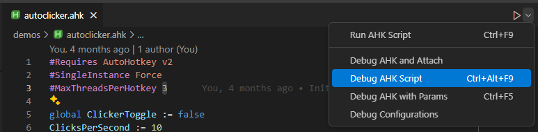

# Debugging

You can use AHK++ as a [debugger](https://en.wikipedia.org/wiki/Debugger) for AHK scripts.

## Via keyboard shortcut

When an AHK file is open, press `Ctrl+Alt+F9` to start debugging.

## Via title bar

AHK++ adds run and debug buttons to the editor's title bar whenever an AHK file is opened.

1. Open an AHK file
1. Find the run button near the top right of the editor
1. Click the dropdown alt of the run button
1. Click "Debug AHK Script"



## Via launch.json

🟦 launch.json currently works for AHK v1 only.

⚠️ There are some known issues with AHK++ support for debug configurations, refer to [#603](https://github.com/mark-wiemer/ahkpp/issues/603) for details.

VS Code supports debug configurations definitions in `.vscode/launch.json`. This can be a useful way to run your `main.ahk` script from wherever you are in your workspace with a single keystroke.

1. Create `.vscode/launch.json` in your workspace
1. Populate it with whatever launch config you prefer, for example:

    ```jsonc
    {
        "version": "0.2.0",
        "configurations": [
            {
                "type": "ahk",
                "request": "launch",
                "name": "AutoHotkey debugger",
                "program": "${workspaceFolder}\\main.ahk1", // requires backslashes for now
                "stopOnEntry": true,
            },
        ],
    }
    ```

1. Press `F5` to debug your project
